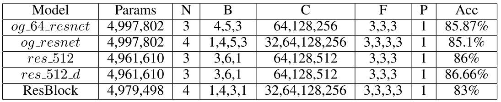
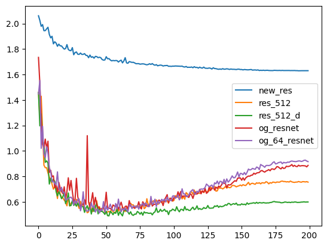

## ResNet under 5M parameters to perform image classification on CIFAR-10 dataset

<br>

### Project Introduction

In this repository, we tried to build a ResNet model which has under 5M trainable parameters. We experimented with 5 diffrerent model architectures to see which one performs best.


From our experimentation, res_512_d is our best performing model with LeakyRelu activation, Cosine Annealing learning rate scheduler and SGD optimiser and dropout layer.

For more information about the model architectures or other techniques which we have used, please refer to the "Project Report.pdf" file

<br>

### Code Files

All the python notebooks which we used for training can be found in the "./training" folder.

> The five models which we experimented with can be found in separate folders respectively inside "./training" folder <br>

> The folder "./training/chaiging_activations" contains the different activation functions which we experimented with over the res_512_d model \
> The folder "./training/changing_optimisers" contains the different optimisers which we experimented with over the res_512_d model. <br>

<br>
Each folder contains the following files

> test_acc_history.txt -> accuracy history of the model over test data \
> test_loss_history.txt -> loss history of the model over test data \
> train_acc_history.txt -> accuracy history of the model over train data \
> train_loss_history.txt -> loss history of the model over train data

<br>

### Run the code

All the models were trained in a Python 3.9.16 Anaconda environment over CUDA 12.0, PyTorch 2 and RTX 3070 GPU. \
All the required python libraries used in this project can be found the "requirements.txt" file. \

Install the requirements by running the following command:

```
pip install -r requirements.txt
```

Now you should be able to run all the jupyter notebooks inside the "./training" folder.

<br>

### Results

 \
This graph shows the model validation loss v/s epoch. Each model is trained for 200 epoch and from the data on the graph, we can observe that our best performing model res_512_d has the lowest loss on the test data compared to other models.
